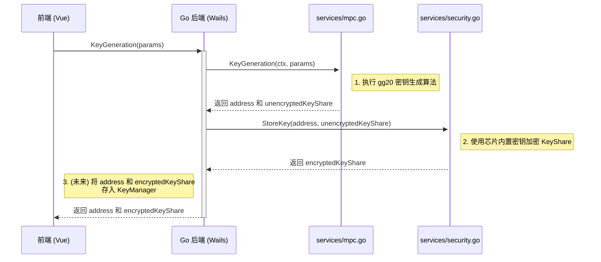
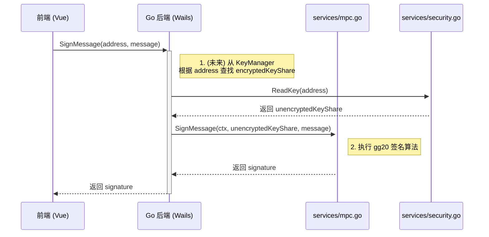

# 开发者指南

本文档为 `offline-client-wails` 项目的所有开发者提供全面的技术参考、开发流程和架构说明。

## 目录

1.  [**项目架构总览**](#1-项目架构总览)
    *   [分层架构](#分层架构)
    *   [核心组件交互图](#核心组件交互图)
    *   [代码目录结构](#代码目录结构)
2.  [**通用开发环境设置**](#2-通用开发环境设置)
    *   [环境要求](#环境要求)
    *   [安装依赖](#安装依赖)
    *   [启动开发模式](#启动开发模式)
    *   [构建生产版本](#构建生产版本)
3.  [**角色驱动的开发指南**](#3-角色驱动的开发指南)
    *   [**3.1 前端开发者 (Vue.js)**](#31-前端开发者-vuejs)
        *   [主要职责](#主要职责)
        *   [关键文件](#关键文件)
        *   [如何调用 Go 后端方法](#如何调用-go-后端方法)
        *   [状态管理 (Vuex)](#状态管理-vuex)
    *   [**3.2 Wails 后端开发者 (Go)**](#32-wails-后端开发者-go)
        *   [主要职责](#主要职责-1)
        *   [关键文件](#关键文件-1)
        *   [向前端暴露新方法](#向前端暴露新方法)
        *   [状态管理与服务协调](#状态管理与服务协调)
    *   [**3.3 安全芯片开发者 (JavaCard)**](#33-安全芯片开发者-javacard)
        *   [主要职责](#主要职责-2)
        *   [APDU 通信协议](#apdu-通信协议)
        *   [构建与部署 Applet](#构建与部署-applet)
    *   [**3.4 云端服务开发者**](#34-云端服务开发者)
        *   [主要职责](#主要职责-3)
        *   [WebSocket 通信协议](#websocket-通信协议)
        *   [与客户端的交互流程](#与客户端的交互流程)
4.  [**核心工作流详解**](#4-核心工作流详解)
    *   [密钥生成流程](#密钥生成流程)
    *   [签名流程](#签名流程)
5.  [**API 设计与 Code Review**](#5-api-设计与-code-review)
    *   [Wails 接口设计原则](#wails-接口设计原则)
    *   [当前架构的核心问题](#当前架构的核心问题)
    *   [推荐的重构方案](#推荐的重构方案)

---

## 1. 项目架构总览

### 分层架构

本项目是一个典型的三层（或四层，如果包含硬件）架构：

1.  **前端 (Vue.js)**: 用户界面，负责与用户交互和展示数据。
2.  **Wails 绑定层**: 连接前端和后端的桥梁，自动处理 Go 方法到 JavaScript 的转换。
3.  **Go 后端**: 应用的核心业务逻辑，包括：
    *   **应用层 (`app.go`)**: 直接暴露给 Wails 的接口。
    *   **服务协调层 (`wails_services.go`)**: 封装和管理底层服务。
    *   **核心服务层 (`services/`)**: 实现 MPC 和安全芯片的具体逻辑。
4.  **硬件层 (`seclient/`)**: 与物理安全芯片通信的底层驱动。

### 核心组件交互图

```mermaid
graph TD
    subgraph Frontend [🖥️ 前端 Vue.js]
        A[UI Components] --> B{API Services}
    end

    subgraph Cloud [☁️ 云端服务器]
        F[Session & User Mgmt]
    end

    subgraph Backend [⚙️ Go 后端 (Wails)]
        D[app.go] --> E[wails_services.go]
        E --> G[services/mpc.go]
        E --> H[services/security.go]
        H --> I[seclient]
    end

    subgraph Hardware [💳 安全芯片]
        J[JavaCard Applet]
    end

    B -- HTTP/WS --> F
    B -- Wails JS Bridge --> D
    I -- APDU --> J
```

### 代码目录结构

```
offline-client-wails/
├── app.go                     # Wails 应用层，暴露给前端的接口
├── wails_services.go          # 服务协调层，封装核心服务
├── main.go                    # 应用主入口
├── go.mod                     # Go 依赖
├── frontend/                  # Vue.js 前端项目
│   ├── src/
│   │   ├── services/
│   │   │   ├── api.js         # 与云端服务器的 API
│   │   │   ├── wails-api.js   # 与 Go 后端的 API (手动封装)
│   │   │   └── ws.js          # WebSocket 服务
│   │   └── views/             # 页面组件
│   └── wailsjs/               # Wails 自动生成的 JS/TS 绑定
├── services/                  # 核心业务服务
│   ├── mpc.go                 # 多方计算核心逻辑
│   └── security.go            # 安全芯片核心逻辑
├── seclient/                  # 与硬件通信的底层客户端
├── config/                    # 应用配置
└── clog/                      # 日志系统
```

---

## 2. 通用开发环境设置

### 环境要求

- **Go**: 1.23+
- **Node.js**: 16+
- **Wails CLI**: v2.10.2+
- **Java JDK 8+** & **Ant**: (仅限安全芯片开发者)

### 安装依赖

```bash
# 安装 Wails CLI
go install github.com/wailsapp/wails/v2/cmd/wails@latest

# 克隆项目
git clone https://github.com/ceyewan/crypto-custody.git
cd crypto-custody/offline-client/offline-client-wails

# 安装 Go 依赖
go mod tidy

# 安装前端依赖
cd frontend
npm install
cd ..
```

### 启动开发模式

```bash
# 这会同时启动 Go 后端和 Vue 前端，并提供热重载
wails dev
```

### 构建生产版本

```bash
# 构建适用于当前操作系统的应用
wails build

# 构建产物位于 build/bin/ 目录
```

---

## 3. 角色驱动的开发指南

### 3.1 前端开发者 (Vue.js)

#### 主要职责
- 开发和维护用户界面 (`.vue` 文件)。
- 通过 `wails-api.js` 和 `api.js` 与后端和云端进行数据交互。
- 使用 Vuex 管理应用状态。

#### 关键文件
- `frontend/src/views/*.vue`: 页面级组件。
- `frontend/src/services/wails-api.js`: **核心文件**。手动封装对 Wails Go 方法的调用，提供更友好的接口给上层使用。
- `frontend/src/services/api.js`: 与云端 HTTP 服务器通信。
- `frontend/src/services/ws.js`: 管理与云端 WebSocket 服务器的连接。
- `frontend/wailsjs/`: **自动生成，请勿手动修改**。

#### 如何调用 Go 后端方法

1.  **Wails 自动生成绑定**: 当 Go 后端在 `app.go` 中暴露一个新方法后，Wails 会在 `frontend/wailsjs/go/main/App.js` 中自动生成一个对应的 JavaScript 函数。
2.  **在 `wails-api.js` 中封装**: 为了更好的代码组织和错误处理，我们不直接在 Vue 组件中调用自动生成的函数，而是在 `wails-api.js` 中进行封装。

**示例: 封装 `GetCPLC` 方法**
```javascript
// frontend/src/services/wails-api.js

// 1. 导入自动生成的函数
import { GetCPLC } from '../../wailsjs/go/main/App'

export const seApi = {
  // 2. 封装成一个易于调用的 Promise
  getCPLC() {
    return GetCPLC().then(response => {
      if (!response.success) {
        // 统一处理业务错误
        return Promise.reject(new Error(response.error));
      }
      return response.data;
    }).catch(error => {
      // 统一处理系统级错误
      console.error("GetCPLC system error:", error);
      throw error;
    });
  }
}
```

3.  **在 Vue 组件中使用**
```javascript
// MyComponent.vue
import { seApi } from '@/services/wails-api';

export default {
  methods: {
    async fetchCPLC() {
      try {
        const cplcData = await seApi.getCPLC();
        this.cplc = cplcData.cplc_info;
      } catch (error) {
        this.$message.error(error.message);
      }
    }
  }
}
```

### 3.2 Wails 后端开发者 (Go)

#### 主要职责
- 将底层的 MPC 和安全芯片服务封装成接口，供前端调用。
- 在 `app.go` 中定义与前端交互的接口。
- 管理应用生命周期和配置。

#### 关键文件
- `app.go`: **接口暴露层**。所有 `App` 结构体的**公开 (Public)** 方法都会被 Wails 自动暴露给前端。
- `wails_services.go`: **服务协调层**。这是解决当前架构问题的关键。它负责初始化所有底层服务（MPC, Security），并为 `app.go` 提供清晰、统一的调用入口。**业务逻辑不应放在 `app.go`，而应放在这里**。
- `services/`: 包含 `mpc.go` 和 `security.go`，是实际执行密码学操作的地方。

#### 向前端暴露新方法

1.  **在 `services/` 中实现核心逻辑** (如果需要)。
2.  **在 `wails_services.go` 中创建协调方法**，调用核心逻辑。
3.  **在 `app.go` 中创建 `App` 的一个新公开方法**，该方法调用 `wails_services.go` 中的协调方法，并处理返回给前端的数据格式（通常是 `map[string]interface{}`）。
4.  重启 `wails dev`，Wails 会自动重新生成前端绑定。

#### 状态管理与服务协调
`wails_services.go` 使用单例模式来确保 `MPCService` 和 `SecurityService` 只被初始化一次。这是管理数据库连接、硬件句柄等资源的正确方式。

**核心问题**: 当前 `SignMessage` 无法工作，因为它不知道 `KeyGeneration` 生成的密钥。解决方案是在 `WailsServices` 中引入一个**状态管理器**（例如 `KeyManager`），用于在内存或文件中持久化密钥信息。

### 3.3 安全芯片开发者 (JavaCard)

#### 主要职责
- 维护 `secured/src/securitychip/SecurityChipApplet.java` 中的 Applet 逻辑。
- 定义和实现 APDU 指令。
- 确保 Applet 的安全性和健壮性。

#### APDU 通信协议
请参考 `secured/DEVELOPMENT.md`，其中详细定义了 `STORE_DATA`, `READ_DATA`, `DELETE_DATA` 三个指令的 APDU 结构、参数和状态码。

#### 构建与部署 Applet
1.  **修改代码**: 编辑 `SecurityChipApplet.java`。
2.  **更新公钥 (如果需要)**: 如果 `genkey/` 目录生成了新的密钥对，必须将新公钥硬编码到 `.java` 文件中。
3.  **构建**: 在 `secured/` 目录下运行 `ant`。
    ```bash
    cd ../secured
    ant
    ```
    这会生成 `build/cap/securitychip.cap` 文件。
4.  **部署**: 使用供应商工具（如 `pygse`）将 `.cap` 文件安装到物理芯片上。

### 3.4 云端服务开发者

#### 主要职责
- 维护与此客户端交互的云端服务器。
- 定义 WebSocket 消息格式和 HTTP API 接口。
- 协调多用户之间的 MPC 会话（密钥生成、签名）。

#### WebSocket 通信协议
客户端通过 `frontend/src/services/ws.js` 与云端建立 WebSocket 连接。协议应定义清晰的消息类型，例如：
- **请求类**: `keygen_request`, `sign_request`
- **响应类**: `keygen_response`, `sign_response`
- **通知类**: `participant_joined`, `session_started`, `task_completed`

#### 与客户端的交互流程
以**密钥生成**为例：
1.  客户端通过 WebSocket 发送 `keygen_request`，包含参数（如 `threshold`, `parties`, `participants`）。
2.  云端服务器收到请求，创建会话，并向所有指定的参与者广播 `session_started` 通知。
3.  云端协调各方进行多轮通信。
4.  每当一个参与方完成其本地计算，它会通过 WebSocket 将结果发送给服务器。
5.  服务器聚合结果，并将下一轮的输入数据分发给各方。
6.  所有轮次结束后，服务器向所有参与方广播 `task_completed`，并附带最终结果（如公钥地址）。

---

## 4. 核心工作流详解

### 密钥生成流程



### 签名流程



---

## 5. API 设计与 Code Review

### Wails 接口设计原则
- **强类型优于 `map`**: 尽可能为 Wails 方法的参数和返回值定义 `struct`。Wails 会自动为其生成 TypeScript 类型，提供前端类型安全。
- **接口应保持简洁**: `app.go` 中的方法应只做参数校验和调用服务层，不应包含复杂业务逻辑。
- **统一响应模型**: 所有方法都应返回一个统一的结构体，如 `APIResponse`，包含成功状态、数据和错误信息。

### 当前架构的核心问题
1.  **状态管理缺失**: `KeyGeneration` 和 `SignMessage` 是解耦的。签名时无法获取到之前生成的密钥信息。
2.  **参数硬编码**: `threshold`, `parties` 等重要参数在 `wails_services.go` 中被硬编码，无法由前端配置。
3.  **接口语义不明确**: `DeleteMessage` 方法名不清晰，且实现为空。

### 推荐的重构方案
1.  **引入参数化结构体**:
    ```go
    // 为 KeyGeneration 定义参数
    type KeyGenParams struct {
        Threshold int    `json:"threshold"`
        Parties   int    `json:"parties"`
        UserName  string `json:"userName"`
    }
    // 修改 app.go 中的方法签名
    func (a *App) KeyGeneration(params KeyGenParams) APIResponse
    ```
2.  **实现状态管理器 (`KeyManager`)**:
    在 `wails_services.go` 中创建一个 `KeyManager`，用于存储 `address` 和 `encryptedKey` 的映射关系。它可以是内存中的一个 `map`，也可以持久化到本地文件中。
3.  **统一响应模型 (`APIResponse`)**:
    ```go
    type APIResponse struct {
        Success bool        `json:"success"`
        Data    interface{} `json:"data,omitempty"`
        Error   string      `json:"error,omitempty"`
    }
    ```
    让所有 `app.go` 中的方法都返回这个结构体，使前端处理逻辑高度一致。
